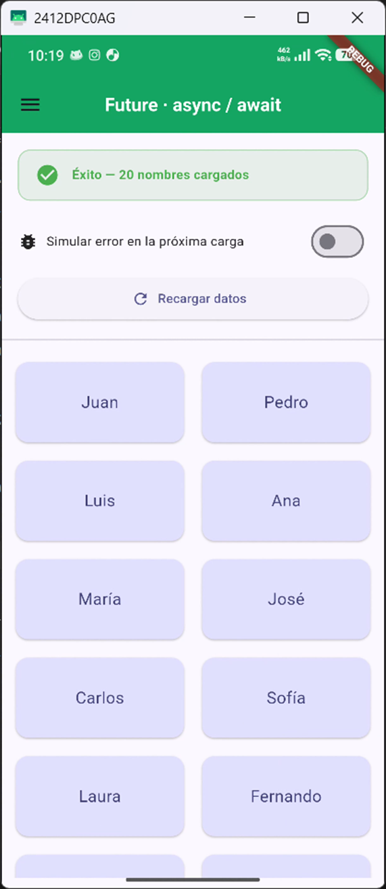
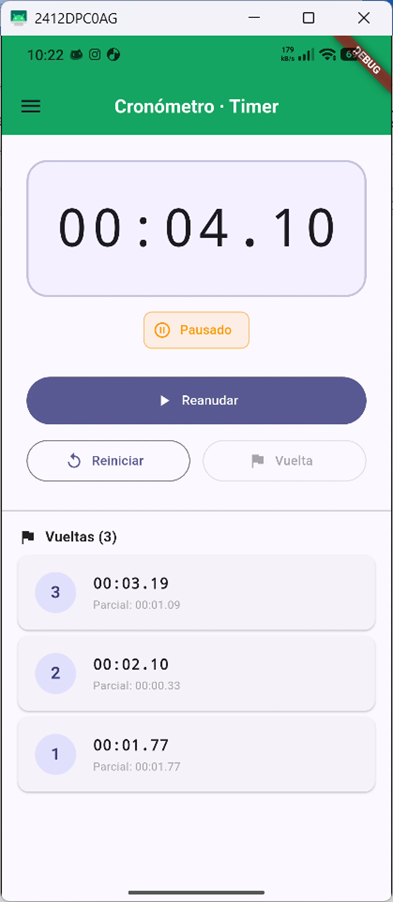
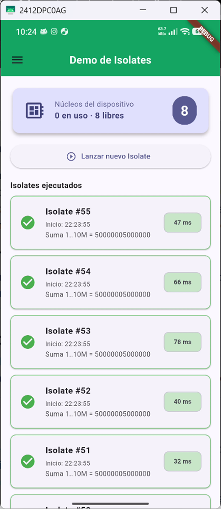

# Taller: Trabajo en Segundo Plano en Flutter

**Materia:** Electiva – Desarrollo Móvil  
**Estudiante:** Jose Alejandro Loaiza López  
**Fecha:** Abril 2026  
**Branch:** `feature/taller_segundo_plano`

---

## 📋 Descripción General

Este proyecto demuestra las principales herramientas de Dart/Flutter para ejecutar **trabajo en segundo plano** sin bloquear la interfaz de usuario:

| Herramienta | Propósito | Pantalla |
|---|---|---|
| `Future` / `async` / `await` | Operaciones asíncronas (consultas, APIs) | Future · async/await |
| `Timer` | Tareas periódicas / cronómetro | Cronómetro · Timer |
| `Isolate` | Cómputo pesado en hilo separado (CPU-bound) | Demo de Isolates |

---

## 📂 Estructura del Proyecto

```
lib/
├── main.dart                          # Punto de entrada
├── routes/
│   └── app_router.dart                # Definición de rutas (go_router)
├── themes/
│   └── app_theme.dart                 # Tema global de la aplicación
├── views/
│   ├── home/
│   │   └── home_screen.dart           # Pantalla principal
│   ├── future/
│   │   └── future_view.dart           # Punto 1: Future / async / await
│   ├── timer/
│   │   └── timer_view.dart            # Punto 2: Timer (cronómetro)
│   ├── isolate/
│   │   └── isolate_view.dart          # Punto 3: Isolate
│   ├── ciclo_vida/
│   │   └── ciclo_vida_screen.dart     # Taller anterior
│   └── paso_parametros/
│       ├── paso_parametros_screen.dart
│       └── detalle_screen.dart
└── widgets/
    ├── base_view.dart                 # Scaffold reutilizable con Drawer
    └── custom_drawer.dart             # Menú lateral de navegación
```

---

## 1️⃣ Future / async / await

### ¿Cuándo usarlo?

Se usa para **operaciones asíncronas que no bloquean la UI**, como:
- Consultas HTTP a APIs REST.
- Lectura/escritura de archivos o bases de datos locales.
- Cualquier operación de I/O que requiera esperar un resultado.

### ¿Cómo funciona?

```dart
Future<List<String>> cargarNombres() async {
  await Future.delayed(const Duration(seconds: 3)); // simula latencia
  return ['Juan', 'Pedro', 'Luis', ...];
}
```

- `Future<T>` representa un valor que estará disponible **en el futuro**.
- `async` marca una función como asíncrona.
- `await` **espera** el resultado del `Future` sin bloquear el hilo principal.


### Orden de ejecución (consola)

```
═══════════════════════════════════════════════
🔵 [ANTES]  Se va a iniciar la carga de datos.
   Hilo principal: UI no se bloquea.
🟡 [DURANTE] Esperando respuesta del Future (3 s)…
🟢 [DESPUÉS] Datos recibidos correctamente (20 elementos).
═══════════════════════════════════════════════
```

### Estados mostrados en pantalla

| Estado | UI | Descripción |
|---|---|---|
| `Cargando` | Spinner + banner naranja | Esperando el `Future.delayed` |
| `Éxito` | GridView con nombres | Datos recibidos correctamente |
| `Error` | Icono + mensaje rojo | Excepción capturada con `try/catch` |

---
Captura:



## 2️⃣ Timer (Cronómetro)

### ¿Cuándo usarlo?

Se usa para **ejecutar código periódicamente a intervalos fijos**, como:
- Cronómetros y cuentas regresivas.
- Polling de datos cada N segundos.
- Animaciones personalizadas basadas en tiempo.
- Timeouts o debouncing de entrada del usuario.

### ¿Cómo funciona?

```dart
// Timer.periodic ejecuta el callback cada 100 ms
_timer = Timer.periodic(const Duration(milliseconds: 100), (_) {
  setState(() {}); // Redibuja la UI con el tiempo actualizado
});

// Cancelar el timer al pausar o salir
_timer?.cancel();
```

- `Timer.periodic` crea un timer que se ejecuta repetidamente.
- Se **cancela** (`cancel()`) al pausar, reiniciar o al salir de la vista (`dispose()`).
- Es fundamental cancelar el timer para **evitar fugas de memoria**.


### Botones y acciones

| Botón | Acción | Timer |
|---|---|---|
| **Iniciar** | Arranca el cronómetro desde 0 | `Timer.periodic(100ms)` |
| **Pausar** | Detiene temporalmente | `_timer.cancel()` |
| **Reanudar** | Continúa desde el tiempo pausado | Nuevo `Timer.periodic` |
| **Reiniciar** | Vuelve a 00:00.00 | `_timer.cancel()` + reset |
| **Vuelta** | Registra el tiempo actual como vuelta | — |

### Limpieza de recursos

```dart
@override
void dispose() {
  _timer?.cancel(); // Cancela el timer al salir de la vista
  super.dispose();
}
```

---
Captura:



## 3️⃣ Isolate (Tarea Pesada)

### ¿Cuándo usarlo?

Se usa para **tareas CPU-bound** que bloquearían el hilo principal (UI thread):
- Procesamiento de imágenes o archivos grandes.
- Cálculos matemáticos intensivos.
- Parsing de JSON/XML enormes.
- Compresión/descompresión de datos.

### ¿Cómo funciona?

```dart
// Se ejecuta en un Isolate separado (función estática/top-level)
static void _simulacionTareaPesada(SendPort sendPort) async {
  final port = ReceivePort();
  sendPort.send(port.sendPort);

  await for (final message in port) {
    // Cálculo pesado: suma 1 a 10.000.000
    int counter = 0;
    for (int i = 1; i <= 10000000; i++) {
      counter += i;
    }
    replyPort.send("Suma 1..10M = $counter");
  }
}

// Desde el hilo principal se lanza el Isolate
await Isolate.spawn(_simulacionTareaPesada, receivePort.sendPort);
```

- `Isolate.spawn()` crea un nuevo hilo de ejecución **aislado**.
- La comunicación entre isolates se hace con `SendPort` y `ReceivePort` (paso de mensajes).
- El isolate **no comparte memoria** con el hilo principal → es thread-safe.

### Comunicación por mensajes

```
Hilo Principal               Isolate
     │                           │
     │── Isolate.spawn() ──────→ │  (se crea el isolate)
     │                           │
     │←── SendPort ─────────────│  (el isolate envía su puerto)
     │                           │
     │── ["Tarea #1", reply] ──→│  (se envía la tarea)
     │                           │  ... cálculo pesado ...
     │←── "Resultado" ──────────│  (resultado por mensaje)
     │                           │
     │                        Isolate.exit()
```

---
Captura:



## 🔑 Resumen: ¿Cuándo usar cada herramienta?

| Escenario | Herramienta | Razón |
|---|---|---|
| Llamada HTTP / lectura de archivos | `Future` + `async/await` | Operación de I/O, no bloquea la UI |
| Esperar múltiples operaciones | `Future.wait()` | Ejecutar varios Futures en paralelo |
| Actualizar la UI periódicamente | `Timer.periodic` | Ejecutar código a intervalos fijos |
| Timeout / retardo simple | `Timer` o `Future.delayed` | Ejecutar algo después de N segundos |
| Cálculo matemático pesado | `Isolate` | Liberar el hilo principal de trabajo CPU |
| Procesamiento de datos grandes | `Isolate` / `compute()` | Evitar que la UI se congele |

---

## 🚀 Cómo ejecutar el proyecto

```bash
# Clonar el repositorio
git clone https://github.com/jose-alejandro-loaiza-lopez/electiva_2026.git

# Instalar dependencias
flutter pub get

# Ejecutar la aplicación
flutter run
```

### Requisitos

- Flutter SDK ≥ 3.11.1
- Dart SDK ≥ 3.11.1
- Un emulador o dispositivo físico configurado

---

## 📱 Navegación

La app utiliza **go_router** para el manejo de rutas y un **Drawer lateral** como menú principal para navegar entre las pantallas:

| Ruta | Pantalla |
|---|---|
| `/` | Dashboard Principal |
| `/future` | Future · async / await |
| `/timer` | Cronómetro · Timer |
| `/isolate` | Demo de Isolates |
| `/ciclo_vida` | Ciclo de Vida |
| `/paso_parametros` | Paso de Parámetros |
